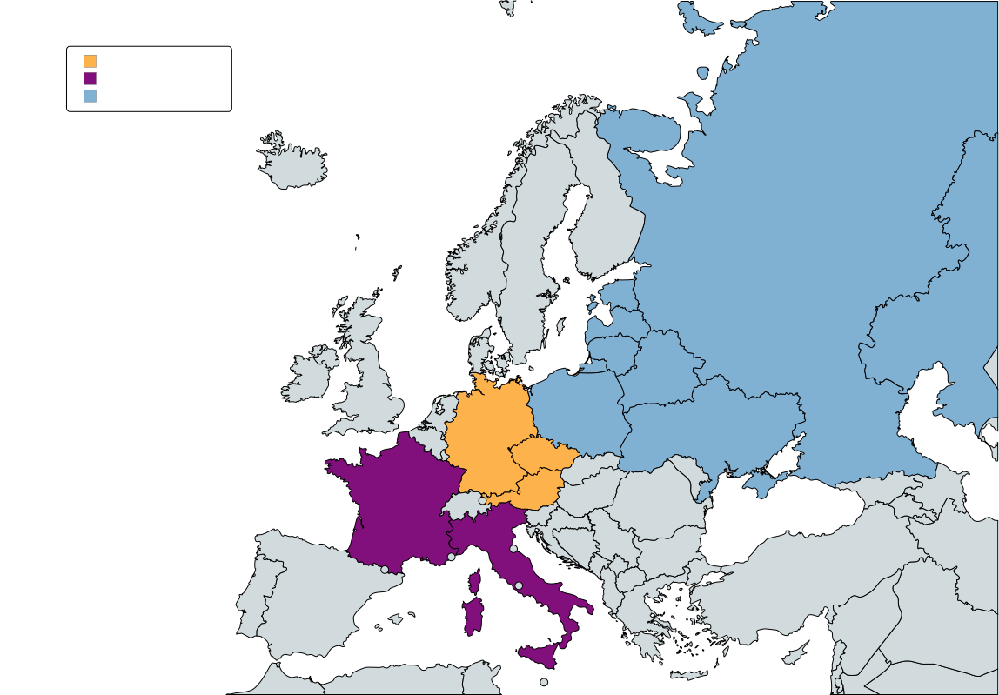

# Pivní války
aneb svět, kde je pivo platidlem.

Každý stát používá jiné značky, a každá značka má svůj kurz jiné značky, např. 1 l Radegastu = 0,7 Plzně

V tomto světě zároveň všichni odmítají obchodovat s Islámskými státy, protože ti považují alkohol za nepřípustný. Nakonec je ale možné s nimi obchodovat díky tomu, že oni zase mají opium.

Poté proběhne vzpoura některých Evropských států, kteří se naštvou za ostatní státy, že mají lepší pivo a tak začnou interně, a později i otevřeně, platit vínem.
Na rozdíl od Sovětského zvazu, který se rozhodl vynucovat vodku jako platitlo, následkem čehož zkrachoval, se jim podaří zotavit svoji ekonomiku.

Kvůli tomuto, a také kvůli roztoucí poptávce po Holandském a Českém pivě, vznikne v Německu krize, kterou vyřeší whiskař, který sice není moc dobrý ve vyrábění Whisky, ale je silný vůdce. Napadne proto výše zmíněné pivní státy, čímž započne dlouhotrvající válku, známou později jako pivní války.

Po tom, co se mu nepodaří sám útočit dostatečně na pivní státy a se spojenectvým s vodkovými státy nic nebylo, kontaktuje Teguilou posedlé Mexiko, aby jim pomohli. Tuto zprávu ovšem zachytí pivní američané, kteří sice nemají dobré pivo, ale mají ho tolik, že je to vlastně jedno a stejně jsou bohatí. Po tomto incidentu napadnou Německo společně s Itálií, která zradila své vinné bratry a napadla Francii. Nakonec je Německo poraženo a rozděleno na 2 pivní, vinný, vodkový sektor. Kvůli nízké poptávce po vodce je ovšem vodkový sektor ekonomicky zaostalejší, což je stále na bývalém vodkovém sektoru poznat i mnohé roky po sjednocení pod pivním sektorem.

## Mapy

### legenda

| barva     | druh alkoholu |
|-----------|---------------|
| oranžová  | pivo          |
| fialová   | víno          |
| modrá     | vodka         |

### 2000

<!-- https://www.mapchart.net/ -->